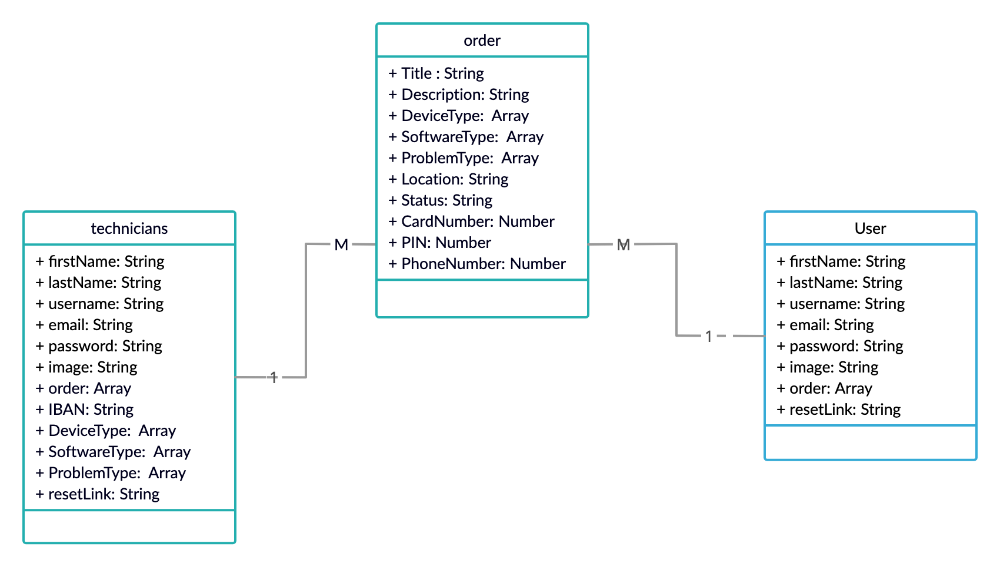

#  ITFixSaudi 
We provide a platform that brings technicians together with customers to provide phone and computer maintenance, either software or hardware.

**Team Members**
* Reem Alsenan
* Shahad Albaydhani 
* Muneerah Asiri 

## Important Links
* [frontend repo](https://git.generalassemb.ly/reemalsenan/Project4-frontend-SEI15)
* [live website](https://itfixsaudi.herokuapp.com/)

## Planning Story
### ER Diagram

### User Stories 
* As a user i can register either as a cutomer or a technician.
* As a user i can login and register.
* As Technician i can pick which type of device i can provide maintenance. 
* As a customer i can pick a technician to fix my device.
* As a customer i can make an order to fix my device.
* As a customer i can pay for the order.
* As a Technician i can either accept or decline the order.

## Installation
```html
npm i // to install all the packages
npm i nodemon //if you don't have nodmon nor node install nodemon by running the following command, if you have them then skip to the next step
nodemon server // to launch the backend
```
## What to Add Next
* live chat
* Reviews
* Rating for the technician
* Dark mode
## Technologies 
* HTML/CSS
* Mongoose
* Node.js
* Express
* Visual Studio Code
* mailgun

## Recources
* [Trello: used for managing the project](https://trello.com/en)
* [Creatly: used for desigin the ER diagram](https://creately.com/?gclid=CjwKCAjwtpGGBhBJEiwAyRZX2tyANMZ5Tcm6VJ7XvcASVNt3HfsIqs5Jy3KE1VHeDTwUQIWgQ123ehoCopQQAvD_BwE)
* [mailGun: used for sending emails to the users](https://www.mailgun.com/)

